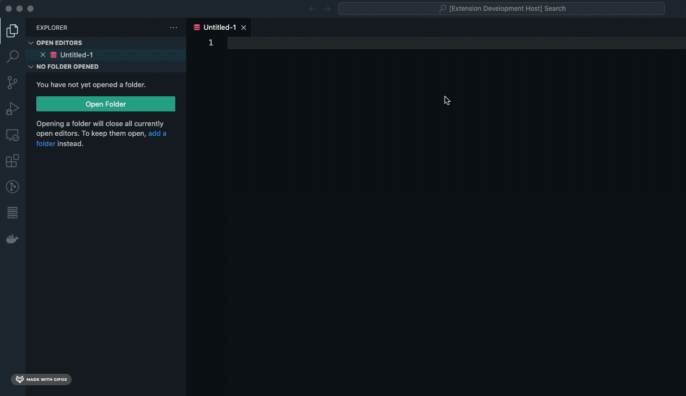
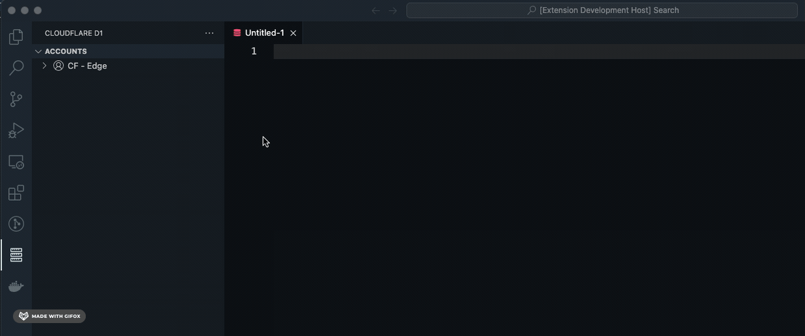
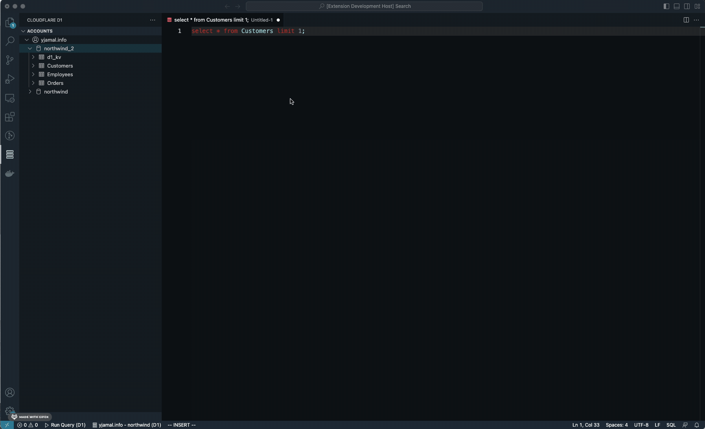
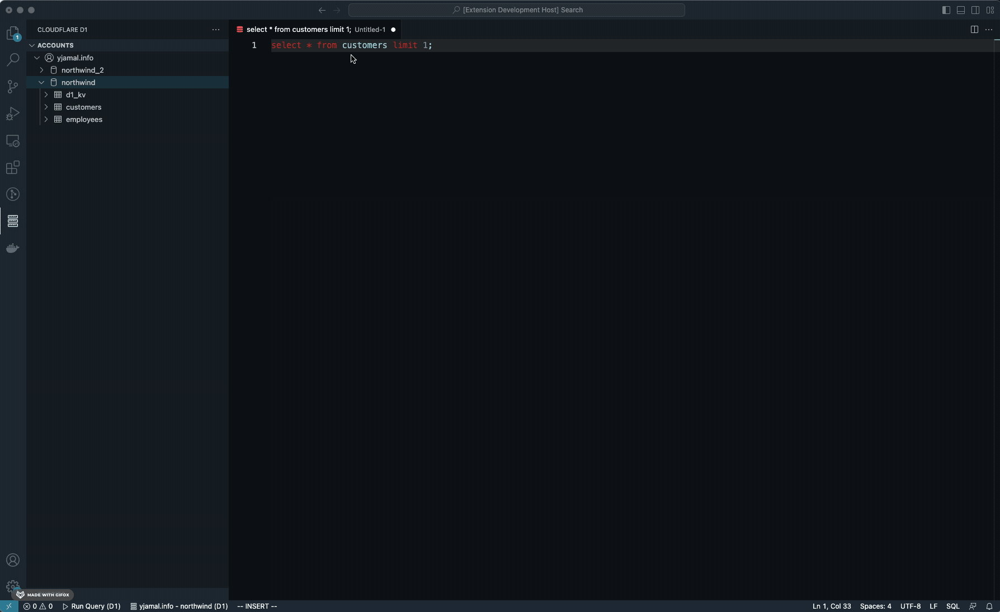

# Cloudflare D1 Extension for Visual Studio Code

The D1 Extension for Visual Studio Code provides a convenient interface for querying and viewing results from Cloudflare's D1 product. With this extension, you can easily run SQL queries against your D1 database across multiple accounts and see the results right in your editor.

## Features

- Connect to your D1 database from within VS Code
- Run SQL queries and see the results in a tabular format
- Easily switch between multiple databases
- Easily Explore table schemas 
- TBD features
  - Export query results to CSV or JSON
  - code completion integration
  - object explorer for views, indexes, etc

## Getting Started

1. Install the extension from the Visual Studio Code Marketplace
2. Open a new or existing SQL file in Visual Studio Code
3. Open the D1 extension sidebar by clicking on the D1 logo in the left sidebar

4. Add a new account

5. Select the desired database

6. Run SQL queries by typing them into the query editor and clicking "Run Query" in the status panel below to see the results in the right pane

## Commands
The extension provides several commands in the Command Palette (prefixed with "D1"):
  * **D1: Add Account**: Connect to a Cloudflare account. Your email and API key is required.
  * **D1: Remove Account**: Remove an account from the object explorer.
  * **D1: Use Database**: Switch to a database within an Cloudflare account, to use as the desired database to run queries against.
  * **D1: Execute Query**: Execute Query script, D1 statements in the editor.
